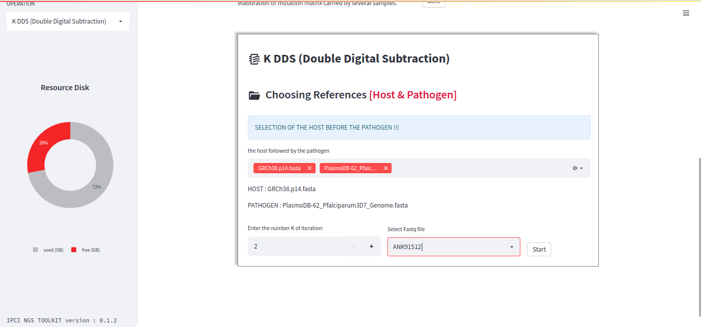

Doudle Digital Soustraction
============================

double digital subtraction is an operation that consists of unmapping the host followed by mapping the pathogen on a given sequence. After these two operations, we run statistics on the files to determine the shares for the host, the pathogen and the others.

.. Note::
  DREPAL-IPCINGSTOOLSKIT is made up of autumn pipelines but to be executed sequentially, i.e. certain operations are conditioned by the result of those which precede them.
