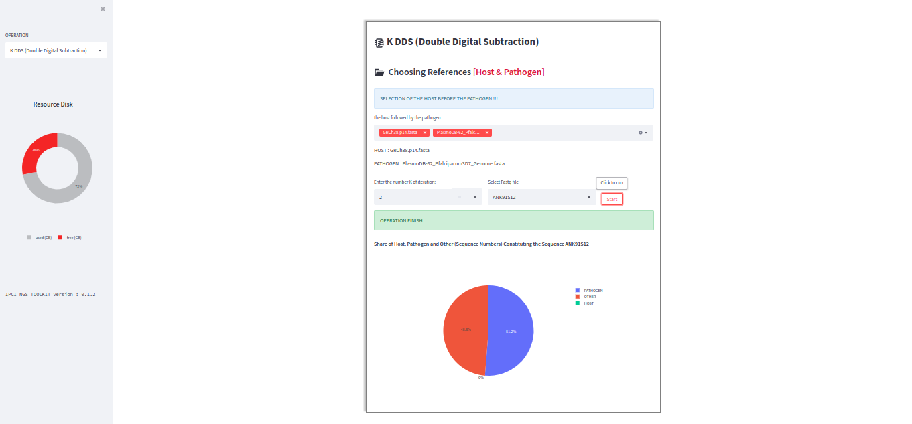

Doudle Digital Soustraction
============================

double digital subtraction is an operation that consists of unmapping the host followed by mapping the pathogen on a given sequence. After these two operations, we run statistics on the files to determine the shares for the host, the pathogen and the others.

.. image:: Images/KDDSapplynew.png
  :alt: Ressource Disk

.. warning::
  always select the host before the pathogen  

Once you have selected the references (host and pathogen), you can choose the number of times you wish to apply digital subtraction to the sequence you select via the "selectbox" containing the IDs of your sequences. Once these parameters have been entered, click on the "Start" button to launch the process.

**Viewing statistics on a sequence**

