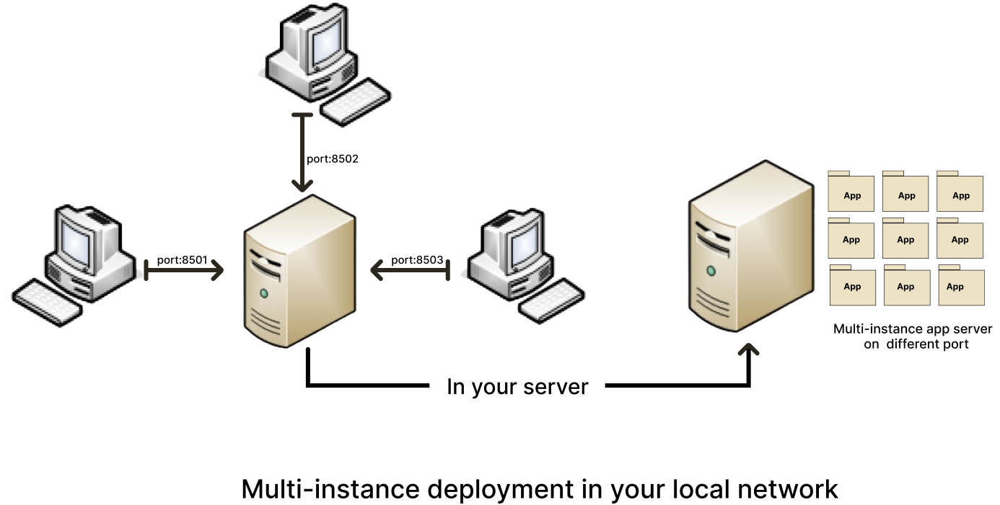

Installation
=============

.. _Download:

Download and Installation of Outbuildings
------------------------------------------
System requirements
~~~~~~~~~~~~~~~~~~~~

Operating system: Ubuntu 20.04.5 LTS and update version (especially all Linux versions based on the Debian distribution).
System architecture: Linux- 64-bit x86.
Minimum ~ 2.5 GB disk space to download and install.The memory resources required for analyses using DREPAL-IPCINGSTOOLSKIT may vary depending on the size and complexity of the sequencing data being processed. For small sequencing datasets (size in MB), a minimum of 16-32 GB RAM is recommended. However, as datasets increase in size, or when performing memory-intensive operations, it may be necessary to allocate more memory. The amount of memory required for specific analyses in DREPAL-IPCINGSTOOLSKIT is often influenced by factors such as the number of samples, read depth and genome size.For our analyses, we used a server equipped with the following resources. These included 2TB of disk space, which enabled us to store and manage large volumes of sequencing data efficiently. In terms of memory, we allocated 64GB of RAM, which enabled us to process memory-intensive operations and meet the various computational requirements of the analysis modules. The server was equipped with an Intel Xeon(R) 4208 processor, 16 cores at 2.16 GHz each.  

Setup process
~~~~~~~~~~~~~~

.. note::

   if git is not installed then follow the procedure in the following : `documentation
   <https://github.com/git-guides/install-git>`_.

or install git on Ubuntu

.. code-block:: console

   sudo apt-get install git-all

To use DREPAL-IPCINGSTOOLKIT, first install it using git for clone repository:

.. code-block:: console

   git clone git@github.com:stanlasso/DREPAL-IPCINGSTOOLKIT.git
   

.. note::

   if you have a version of ``"Anaconda"`` or ``"Miniconda"`` install ignore the step of installation of Miniconda passed directly to that on the creation of the virtual environment.
   

**Install miniconda**

- Install as root
.. code-block:: console

   sudo su
   
- Download Miniconda
.. code-block:: console

   wget https://repo.anaconda.com/miniconda/Miniconda3-latest-Linux-x86_64.sh

- Execute the Miniconda script to install it
.. code-block:: console

   bash Miniconda3-latest-Linux-x86_64.sh
   
once the execution is finished, **close the terminal** then reopen it, *switch to root mode* once more and *activate the basic environment*.

.. code-block:: console

   sudo su

- Entered in the repository clone

.. code-block:: console

   cd DREPAL-IPCINGSTOOLKIT

- Creates an environment for bioinformatics analysis 

.. code-block:: console

   conda env create -f environment.yml
   

- Deactivate conda env

.. code-block:: console

   conda deactivate
   
**Creates an environment for hosting front-end solutions**

* Install virtualenv 
  
.. code-block:: console

   apt install python3-virtualenv
   
.. warning::
   use the command above if your version of ``"python3"`` is higher than **3.8** if it is lower than **3.8** use the command below. 
   to check the version of Python use the command : 
   ``"python3 --version"``.
   

* If your Python < 3.8 : 
  
.. code-block:: console

   apt install virtualenv
  

* Create env with virtualenv : 

.. code-block:: console

   virtualenv myenv

* Activate myenv : 
 
.. code-block:: console

   source myenv/bin/activate

* Install all dependencies : 

.. code-block:: console

   pip install -r requirements.txt
   
   
.. note::
   if you get dependency errors such as ``"ERROR: could not find a version that satisfies the requirement packagename==x.x.x"``, use nano or a text editor to        delete the line containing the package name in *requirements.txt*, then run the above command again. Once the installation of the packages is finished, check     that the missing packages (removed from the requirements.txt) have been installed, as they depend on other packages with ``"pip freeze"``; if they have not been   installed, use the command ``"pip install packagename"``.

**Creates all missing directories**

.. code-block:: console

   bash makedir.sh

*use the tree command to check that you have a file structure similar to the following:*

.. code-block:: console

    APP/data/
    ├── Annoted
    │   ├── AnnotatedFILEbyFILE
    │   │   └── singlefilerepport
    │   └── report
    ├── Bam
    │   └── Mapped
    │       ├── BamFreebayes
    │       └── BamGATK
    ├── chromosome
    ├── combined
    │   ├── 3d7_hb3.combined.final.vcf.gz
    │   └── 3d7_hb3.combined.final.vcf.gz.tbi
    ├── Datafastq
    │   ├── Fastqc
    │   ├── KDSD
    │   ├── ResQC
    │   └── unmapped
    ├── freebayesfile
    │   ├── Filterring
    │   │   └── mergefile
    │   ├── mergevcffile
    │   ├── metrics
    │   ├── txtfile
    │   └── vcffile
    ├── gatkfile
    │   ├── Filterring
    │   │   ├── generation.sh
    │   │   ├── MATRICE
    │   │   ├── MatriceSNPS
    │   │   ├── matrix2.sh
    │   │   └── mergefile
    │   ├── mergevcfile
    │   ├── metrics
    │   ├── recal
    │   ├── textfile
    │   └── vcffile
    ├── intercep
    ├── Reference
    ├── Sam
    ├── variants.bcftools
    │   ├── Filterring
    │   │   ├── filteredType
    │   │   ├── generation.sh
    │   │   ├── MATRICE
    │   │   ├── MatriceSNPS
    │   │   ├── matrix2.sh
    │   │   └── mergefile
    │   ├── mergevcffile
    │   └── metrics
    └── variants.varscan
        └── Filterring
            ├── generation.sh
            └── matrix2Var.sh

**Activated the conda environment**

.. code-block:: console

   conda activate NewENV

Starting the streamlit server
~~~~~~~~~~~~~~~~~~~~~~~~~~~~~~

Streamlit is a Python framework that simplifies the deployment of web applications. It is used to host the front end of DREPAL-IPCINGSTOOLSKIT.

Use the following command to start the server :

.. code-block:: console

   streamlit run APP/app.py

.. _Browser:

In your web browser
-------------------

Open your browser and paste the link below in the search bar.

.. code-block:: console

   http://localhost:8501
   
.. note::
   **If you want to use the app with several people on your local network, you can continue with the following configuration**

Deploy DREPAL-IPCINGSTOOLSKIT for many users
~~~~~~~~~~~~~~~~~~~~~~~~~~~~~~~~~~~~~~~~~~~~~

- example of a schema for deploying DREPAL-IPCINGSTOOLSKIT on a local network :

- Step 1 : Creates many instances

creates several instances of DREPAL-IPCINGSTOOLSKIT on your server *(duplicate and rename)* example for three instances:
``"DREPAL-IPCINGSTOOLSKIT8501"`` ``"DREPAL-IPCINGSTOOLSKIT8502"`` and ``"DREPAL-IPCINGSTOOLSKIT8503"``. 8501.8502 and 8503 will be the ports allocated to these different instances.

- Step 2 : Assign a unique port to each instances

change the default port in the ``"DREPAL-IPCINGSTOOLSKIT/.streamlit/config.toml"`` file ``"(serverPort = 8501)"`` to the port you choose for the instance you are configuring.

- Step 3 : Create SFTP server on your server

**- Instal ssh**
.. code-block:: console
   sudo apt install ssh

**- Enable and Start ssh**
   
.. code-block:: console
   sudo systemctl enable ssh
   sudo systemctl start ssh
   
**- check that your ssh is activated**
   
.. code-block:: console
   sudo systemctl status ssh

**- Create sftp group**
   
.. code-block:: console
   sudo addgroup sftp
 
**- Create sftp user for each instance : example for user 1**

.. code-block:: console
   sudo adduser sftpclient1

.. note::
the number of instances of DREPAL-IPCINGSTOOLSKIT must be identical to the number of users to be created.As in the example above, if ``"sftpclient1"`` is the first user, the next users will be ``"sftpclient2"``, ... ``"sftpclientn"`` or n is the last user.This will apply to future orders :

**- Add users to the sftp group : example for user 1**
.. code-block:: console
   sudo usermod -a -G sftp sftpclient1
   
**- Create the access directory for each user  : example for user 1**

.. code-block:: console
   sudo mkdir -p /var/sftp/User1/Upload
   sudo chown root:root /var/sftp/User1
   sudo chmod 755 /var/sftp/User1
   sudo chown sftpclient1:sftpclient1 /var/sftp/User1/Upload
   
**- Open the ssh configuration file and add the following lines for each user created : example for user 1**

.. code-block:: console
   sudo nano /etc/ssh/sshd_config
      
**- Paste the following lines at the end of the configuration file : example for user 1**

.. code-block:: console
   Match User sftpclient1
          ChrootDirectory /var/sftp/User1
          X11Forwarding no
          AllowTcpForwarding no
          PermitTTY no
          ForceCommand internal-sftp

**- Restart your ssh :**
   
.. code-block:: console
   sudo systemctl restart ssh
   
- Step 4 : Run app :

**- Our  LAN (Local Area Network) for the test**
   

