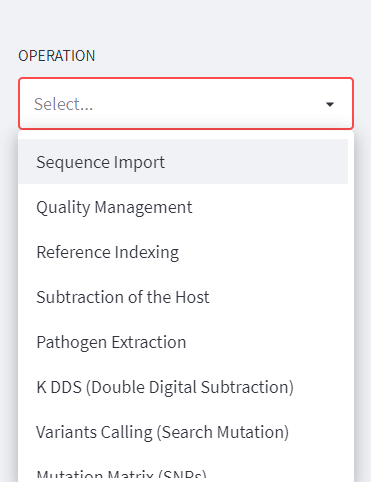

Left Panel
==========

Use of disk ressources
-----------------------
* **Donut diagram of free and used space**

This diagram gives you an overview of the available disk space on the server for your analyses, consult it after each analysis to establish efficient resource management.

.. image:: Images/usagefree.jpg
  :width: 280
  :alt: Ressource Disk

Operations menu
----------------

In the menu you will find all possible operations (see table of available operations), from importing files to emptying the analysis directory.

.. Note::
  DREPAL-IPCINGSTOOLSKIT is made up of autumn pipelines but to be executed sequentially, i.e. certain operations are conditioned by the result of those which precede them.

.. list-table:: Operations and Descriptions
   :widths: 25  75
   :header-rows: 1

   * - Operations
     - Description
   * - Sequence Import
     - In this section import raw sequences and references (host and pathogen.
   * - Quality Management
     - In this section, view the quality of the reads and cut them if necessary.
   * - References Indexing
     - Indexing host and pathogen references.
   * - Substraction of the Host
     - Remove the host's share of the reads.
   * - Pathogen Extraction
     - Kept the corresponding share of pathogens in each reads.
   * - K DDS (Double Digital Subtraction)
     - It is optional to visualise the host, pathogen and other parts contained in each read.
   * - Variants Calling 
     - This is the part of the analysis that consists of finding the mutations by using a number of technologies.
   * - Mutation Matrix (SNPs)
     - The Mutation Matrix (for SNPs) allows us to have an overview of the SNP type mutations for all reads in a spreadsheet facilitating a number of downstream          statistical analyses.
   * - Variants Annotations
     - Used to assign functional information to mutations via Snpeff and SnpSift.
   * - Directory Managemen
     - This section allows for the dumping of what appears to be the scan directory to save disk resources once the scan is complete or in the event of an error.

     
     
     
