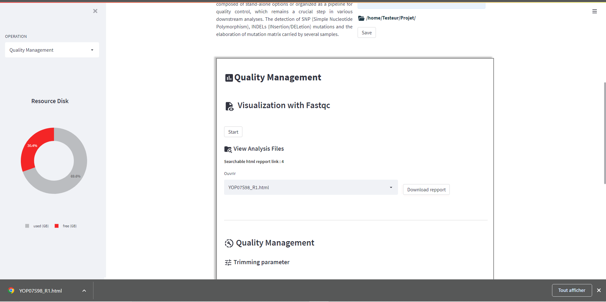

Quality Controle
===============

Assessing the quality of the data resulting from high-throughput sequencing is the first step to take before embarking on bioinformatics analyses.
In DREPAL-IPCINGSTOOLSKIT you have one option dedicated to visualising the quality of reads and another for trimming reads.

.. image:: Images/cd.jpg
  :width: 280
  :alt: Quality Controle big screen
  
If you haven't imported any sequences, you will receive these error messages. Please go back to the sequence import screen and upload your sequences.

.. image:: Images/cd.jpg
  :width: 280
  :alt: Quality control no sequence import

Visualisation
--------------
Quality is displayed using the **Fastqc** tool.To start the visualization with DREPAL-IPCINGSTOOLSKIT, click on the ``"Start"`` button.Once the operation is completed, you will be able to download the results and review them to make crucial decisions for trimming.

Trimming
---------

This diagram gives you an overview of the available disk space on the server for your analyses, consult it after each analysis to establish efficient resource management.
