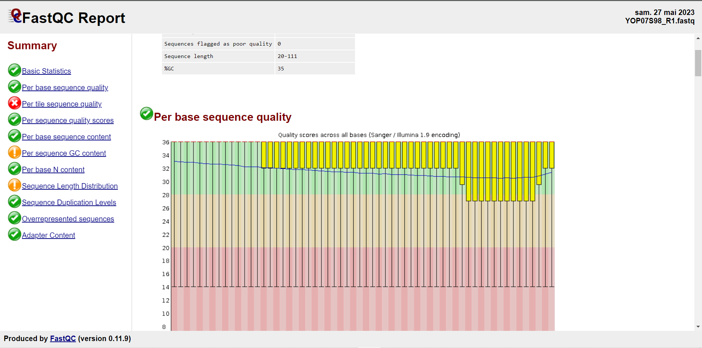

Quality Controle
===============

Assessing the quality of the data resulting from high-throughput sequencing is the first step to take before embarking on bioinformatics analyses.
In DREPAL-IPCINGSTOOLSKIT you have one option dedicated to visualising the quality of reads and another for trimming reads.

.. image:: Images/cd.jpg
  :width: 280
  :alt: Quality Controle big screen
  
If you haven't imported any sequences, you will receive these error messages. Please go back to the sequence import screen and upload your sequences.

.. image:: Images/cd.jpg
  :width: 280
  :alt: Quality control no sequence import

Visualisation
--------------
Quality is displayed using the **Fastqc** tool.To start the visualization with DREPAL-IPCINGSTOOLSKIT, click on the ``"Start"`` button.Once the operation is completed, you will be able to download the results and review them to make crucial decisions for trimming.

.. image:: Images/downloadrepportup.png
  :width: 520
  :alt: Fastqc and open repport

- FastQC Report

Trimming
---------

After visualizing the quality of the reads, trimming will help improve the quality of your reads. If you find your reads to be of good quality, you may choose to skip this operation. However, if you determine that trimming is necessary, enter the trimming parameters. Trimming is performed using the Trim-Galore tool.
Click on the ``"Apply"`` button to initiate the trimming operation.

