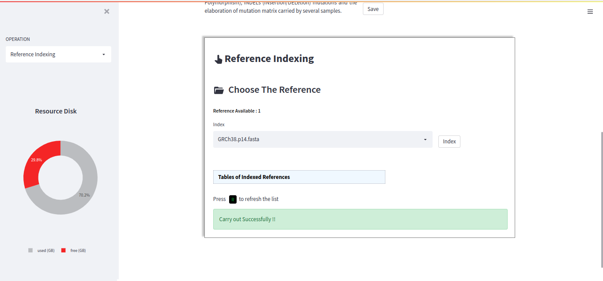
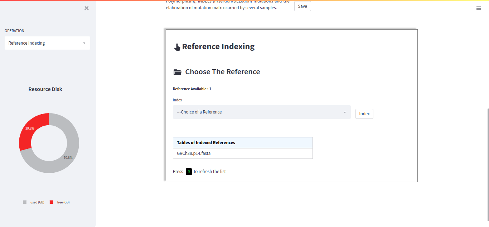

Reference Indexed
==================

The indexing of host and pathogen references facilitates alignment. One advantage of DREPAL-IPCINGSTOOLSKIT is that when a reference is indexed, it is added to a table, avoiding the need to re-import a reference that is already present in the table.

To index a reference, select the name of the reference in the ``"selectbox"``, e.g. ``"Reference.fasta"``, then click on ``"index"`` to index it.

  
Once the indexing process is complete, press the ``"R"`` *(refresh)* key to add the indexed item to the table of indexed references. 

  
  Repeat the same process to add new references to the table.
  
  .. image:: Images/listofrefindexed.png
  :alt: tables all references
