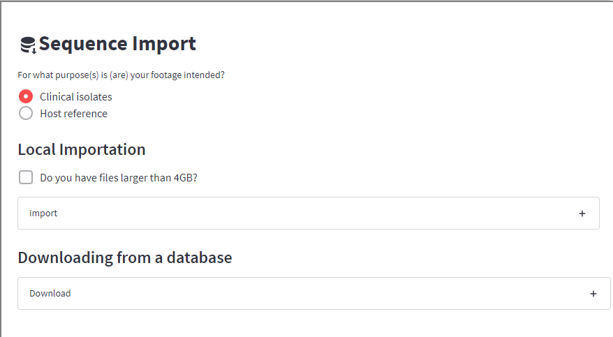
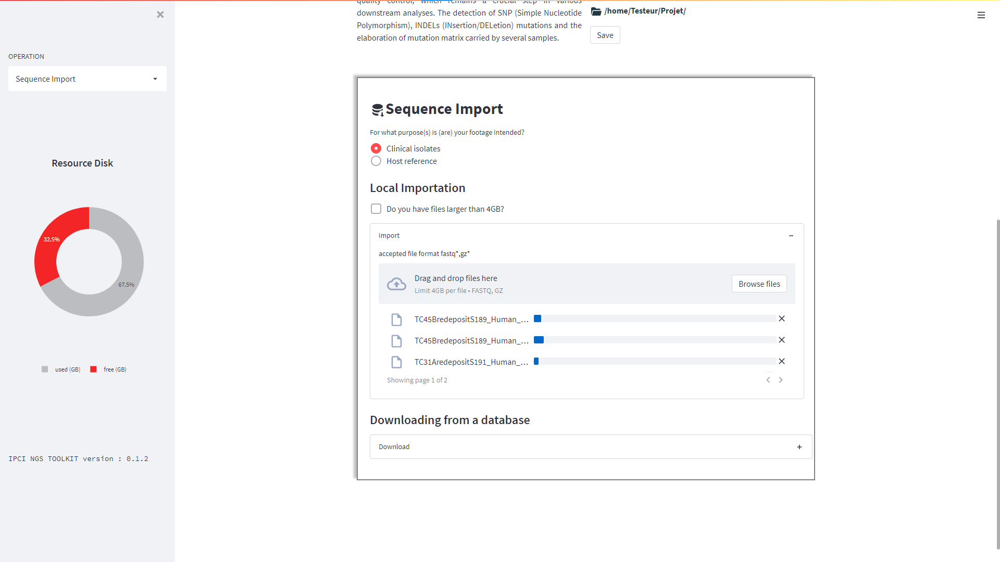
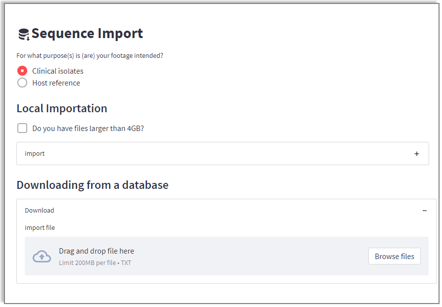
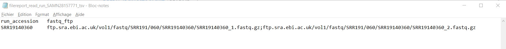
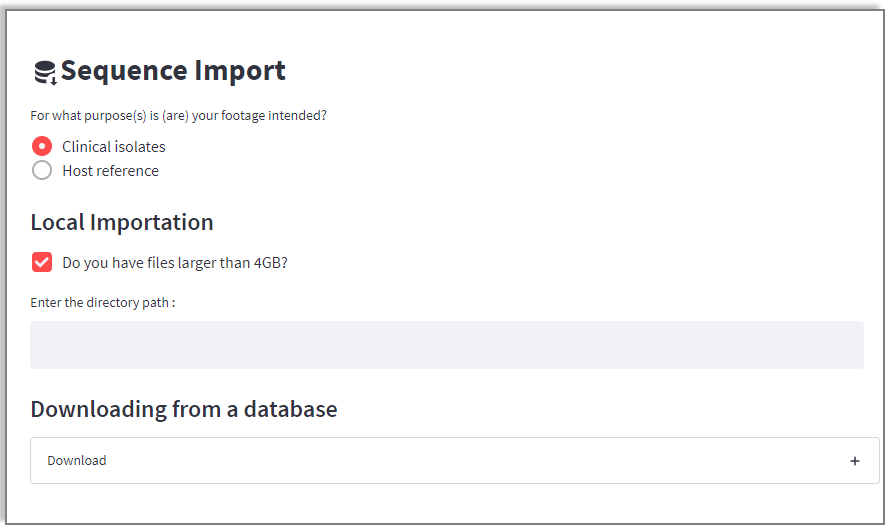
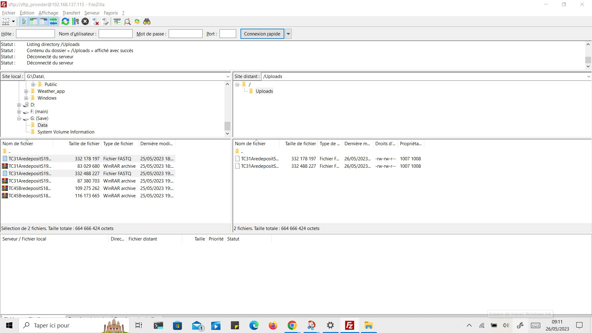
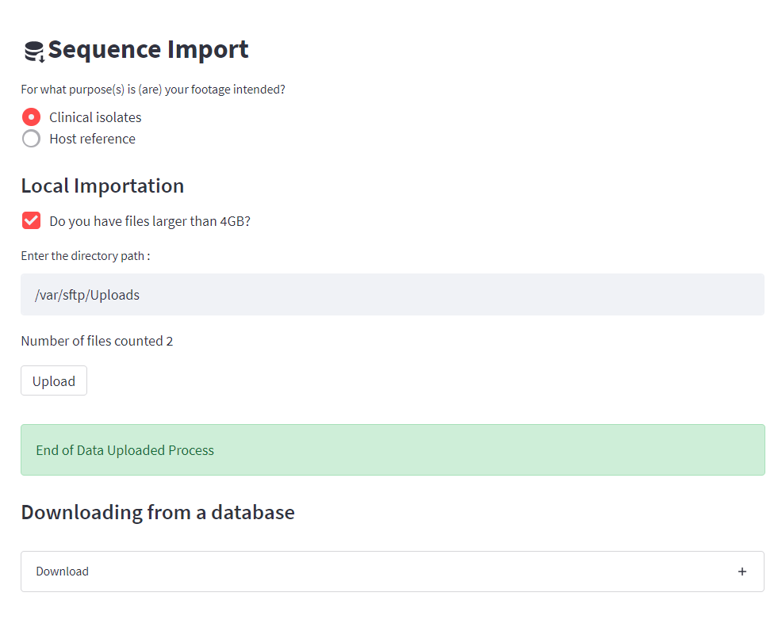
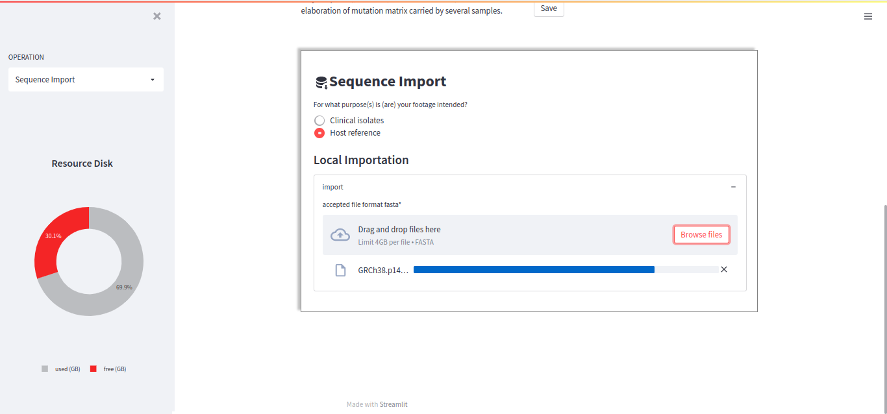
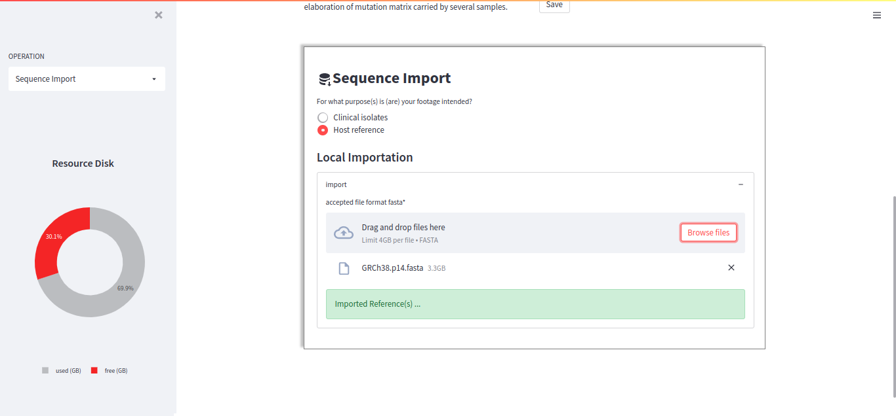

Sequence Import
===============

All the analyses in DREPAL-IPCINGSTOOLSKIT are based on the import of sequences from clinical isolates and references.

Clinical Isolates (fastq,gz)
----------------------------
The clinical isolates represent the raw data in "fastq" or "fastq.gz" format, a compressed, Paired-End format.

.. note::
  file naming in DREPAL-IPCINGSTOOLSKIT is very important. The following nomenclature examples are taken into account:
  
  - ``"xxxxxxxx_R1.fastq"`` et  ``"xxxxxxxx_R2.fastq"``
  
  - ``"xxxxxxxx_1.fastq"`` et   ``"xxxxxxxx_2.fastq"``
  
  in *fastq.gz format.
  
In DREPAL-IPCINGSTOOLSKIT you have three (3) options for importing raw data:

Method 1
~~~~~~~~~
the first import method is the most conventional and consists of using the uploaded section.

.. note::
  Only use it if the file size does not exceed 4Gb.

Method 2
~~~~~~~~~

The second method consists of importing a ``"tsv"`` file containing the ``"ftp"`` link column of the Paired-End files from the EBI.

  
- tsv example :

Method 3
~~~~~~~~~

The third method allows users to upload files larger than 4Gb. It consists in gathering these files "fastq" or "fastq.gz" in a repertory then to paste the path of those in the zone text then to click on button televersé so that your files are imported into DREPAL-IPCINGSTOOLSKIT.if you don't work directly on the server, then the ``"sftp"`` configuration during installation will be very useful. From your Filezilla client you can upload your files.

  
- Client Filezilla

.. note::
  In the case of sftp configurations, the link to be pasted when importing files larger than 4GB is as follows:
  ``"/var/sftp/User1/Upload"`` where *User1* is a user created on the server during sftp configuration.

 

References Import (fasta files)
--------------------------------

For reference imports, the accepted format is ``"fasta"``.

  
When the reference has been successfully imported, the following message will appear:

  

.. note::
  In DREPAL-IPCINGSTOOLSKIT, don't forget to import the host and pathogen references.
