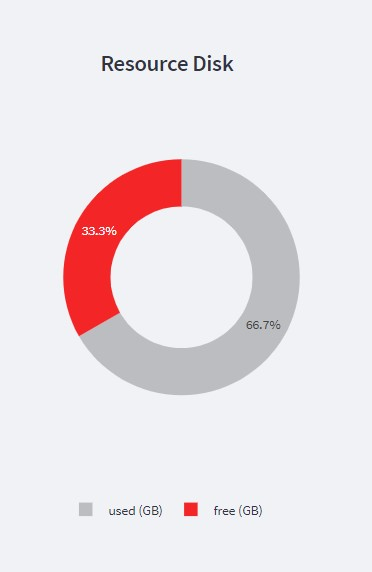

Sequence Import
===============

All the analyses in DREPAL-IPCINGSTOOLSKIT are based on the import of sequences from clinical isolates and references.

.. image:: Images/seqimport.png
  :width: 500
  :alt: main seq import

Clinical Isolates (fastq,gz)
----------------------------
The clinical isolates represent the raw data in "fastq" or "fastq.gz" format, a compressed, Paired-End format.

.. note::
  file naming in DREPAL-IPCINGSTOOLSKIT is very important. The following nomenclature examples are taken into account:
  
  - ``"xxxxxxxx_R1.fastq"`` et  ``"xxxxxxxx_R2.fastq"``
  
  - ``"xxxxxxxx_1.fastq"`` et   ``"xxxxxxxx_2.fastq"``
  
  in *fastq.gz format.
  
In DREPAL-IPCINGSTOOLSKIT you have three (3) options for importing raw data:

Method 1
~~~~~~~~~
the first import method is the most conventional and consists of using the uploaded section.

.. image:: Images/importless4gb.png
  :width: 500
  :alt: main seq import

.. note::
  Only use it if the file size does not exceed 4Gb.

Method 2
~~~~~~~~~

The second method consists of importing a ``"tsv"`` file containing the ``"ftp"`` link column of the Paired-End files from the EBI.

.. image:: Images/ebiftpimport.png
  :width: 500
  :alt: main seq import
  
- tsv example :

.. image:: Images/tsv.png
  :width: 500
  :alt: main seq import

Method 3
~~~~~~~~~

This diagram gives you an overview of the available disk space on the server for your analyses, consult it after each analysis to establish efficient resource management.

References Import (fasta files)
--------------------------------

This diagram gives you an overview of the available disk space on the server for your analyses, consult it after each analysis to establish efficient resource management.

