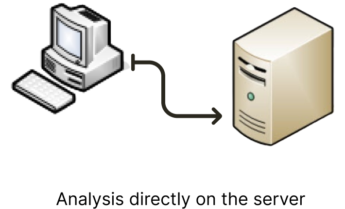
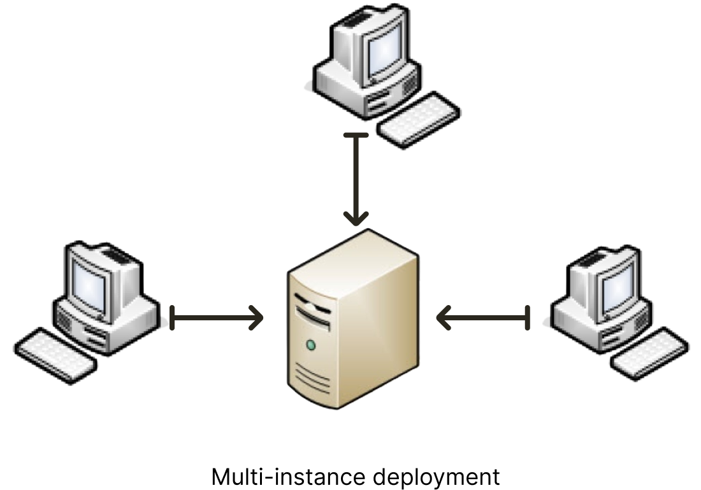
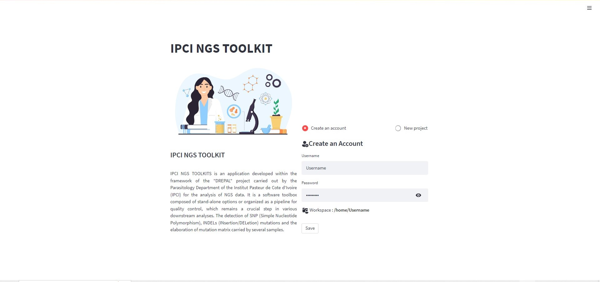
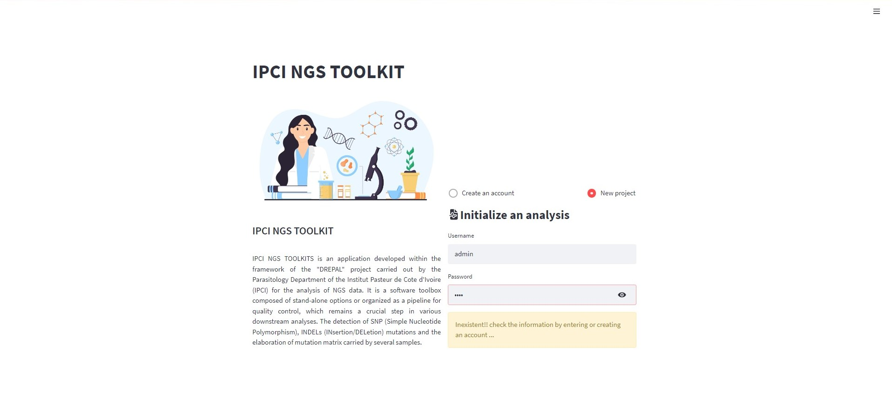

Usage
=====

The DREPAL-IPCINGSTOOLSKIT can be used in two ways. ``"Mode (1)"`` (Analysis directly on the server) and ``"Mode (2)"`` (Multi-instance deployment) usable by many users at the same time.

* Mode 1

* Mode 2

.. Note::

 **Mode 2** will be the subject of an implementation available very soon. The reason for this is the implementation of *SFTP* (Secure File Transfer Protocol) for file uploading. 

Account creation
----------------
Login Screen
~~~~~~~~~~~~
When you open the application, you are asked for a username and password. This depends on how you are using the application. If it is "Mode (1)" where you are the only one using the application, you can create an account or if it is a quick scan, you can connect with the default account ``"username: admin"`` , ``"password: admin"`` by clicking on the new project. 

* Create an account

  
  
 * New project by default compte

